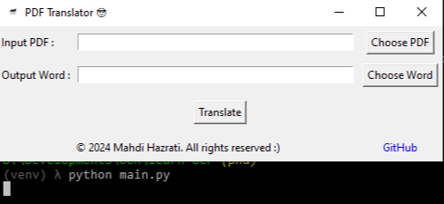

# PDF Translator 😎



PDF Translator is a Python application designed for translating PDF documents from any language to Persian. This tool utilizes PyMuPDF for PDF processing, Google Translate API for translation, and tkinter for the graphical user interface (GUI).

## How to Run the Development Environment with Virtual Environment (venv)

1. Clone this repository to your local machine:

```bash
git clone https://github.com/Mahdi-Hazrati/PDF-Translator.git
```

2. Navigate to the project directory:

```bash
cd PDF-Translator
```

3. Create and activate a virtual environment (optional but recommended):

```bash
python -m venv venv
source venv/bin/activate   # On Linux/macOS
venv\Scripts\activate      # On Windows
```

4. Install the required dependencies from the `requirements.txt` file:

```bash
pip install -r requirements.txt
```

5. Run the application:

```bash
python main.py
```

## Compiling with PyInstaller

To compile the Python script into an executable using PyInstaller, execute the following command:

```bash
pyinstaller --onefile main.py
```

## Download Executable

You can download the compiled executable of this program from the [Releases](https://github.com/Mahdi-Hazrati/PDF-Translator/releases/) section.

## How to Use

1. Run the application by executing `main.py`.
2. Click on "Choose PDF" to select the PDF file you want to translate.
3. Click on "Choose Word" to specify the output Word file path.
4. Click on "Translate" to start the translation process.
5. Once the translation is completed, the translated Word file will be saved at the specified location.

## Acknowledgments

This project was developed as a school exercise to translate PDF documents to Persian.

---

© 2024 by Mahdi - JUST FOR FUN
